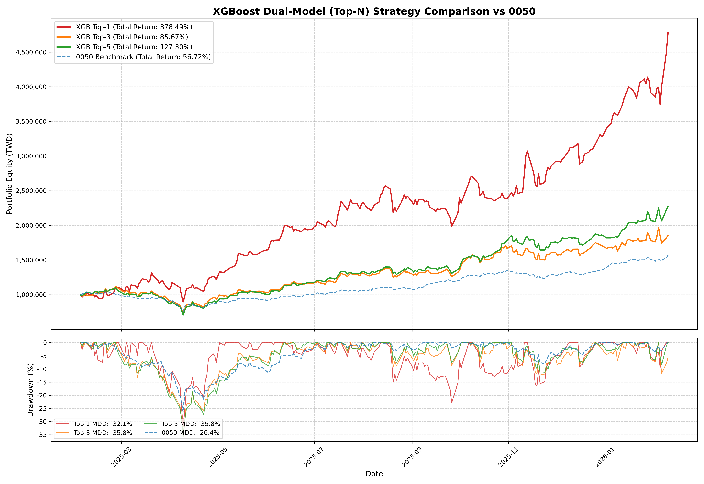
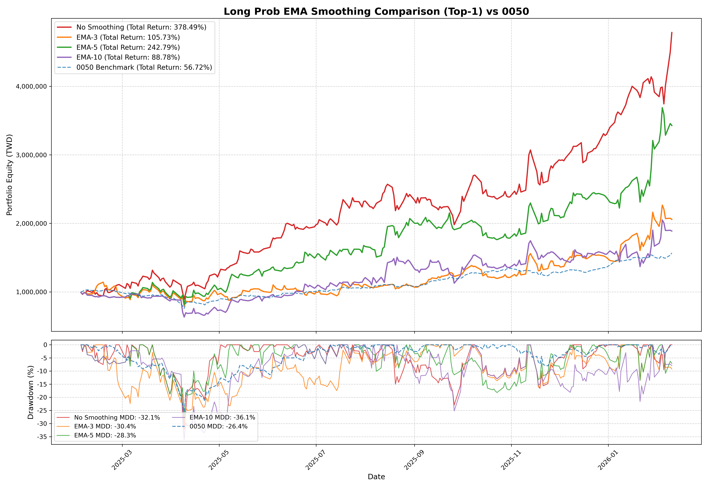
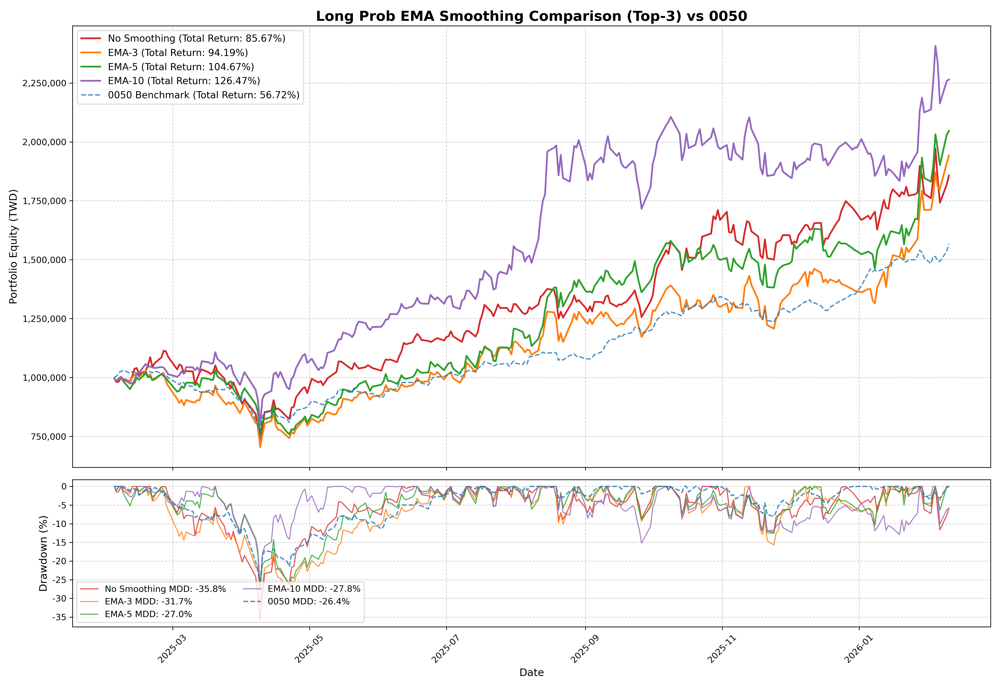
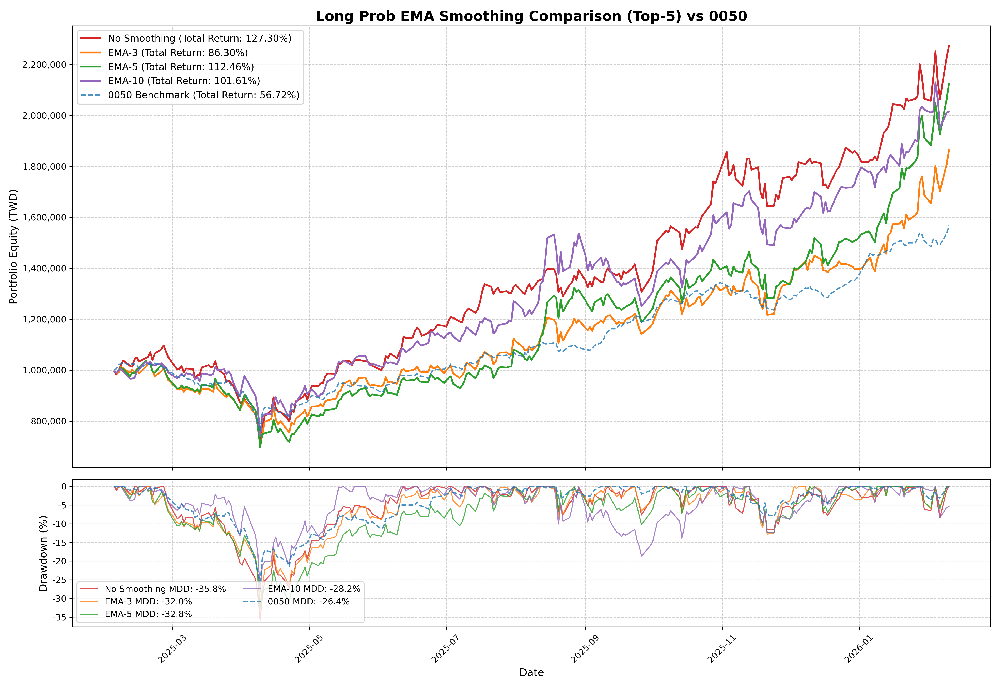

# Believe Merrill Enrich the Meal (BMEM)

A quantitative trading system for Taiwan stocks that uses a two-stage machine learning pipeline to detect institutional broker accumulation/distribution behavior and generate long/short trading signals.

---

## Table of Contents

- [Project Overview](#project-overview)
- [Results at a Glance](#results-at-a-glance)
- [How It Works](#how-it-works)
- [Repository Structure](#repository-structure)
- [Installation](#installation)
- [Quick Start](#quick-start)
- [Full Research Workflow](#full-research-workflow)
- [Production Pipeline](#production-pipeline)
- [Core Algorithms & Features](#core-algorithms--features)
- [Output Format](#output-format)
- [Experiments & Model Selection](#experiments--model-selection)
- [Backtest Results & Discussion](#backtest-results--discussion)
- [Testing](#testing)
- [Key Design Decisions](#key-design-decisions)

---

## Project Overview

BMEM monitors institutional brokers on the Taiwan Stock Exchange and trains an independent HMM + XGBoost model stack for each broker. A broker ID such as `1440` (Merrill Lynch) or `1470` (Morgan Stanley Taiwan) acts as the namespace for raw data, processed datasets, models, backtests, and daily signals.

The system is designed to run daily and outputs a ranked signal CSV indicating which stocks are worth entering in either direction.

---

## Results at a Glance

### Data Split

| Split | Period | Purpose |
|-------|--------|---------|
| Train | 2021 – 2023 | HMM training + XGBoost training |
| Validation | 2024 | XGBoost early stopping + threshold tuning |
| **Test (Backtest)** | **2025** | **Out-of-sample portfolio simulation — never touched during training** |

### Out-of-Sample Performance (2025, TWD 1,000,000 initial capital)

The results below are from the original `1440` model and are retained as the project baseline.



| Strategy | Total Return | Max Drawdown | Trades | Win Rate |
|----------|-------------|--------------|--------|----------|
| **Top-1 (best)** | **+378.49%** | -32.1% | 33 | **69.70%** |
| Top-5 | +127.30% | -35.8% | 188 | 55.85% |
| Top-3 | +85.67% | -35.8% | 121 | 54.55% |
| 0050 Benchmark | +56.72% | -26.4% | — | — |

The **Top-1 strategy** — hold the single highest-confidence signal at any given time — achieved **+378% return** on the fully held-out 2025 test year, outperforming the 0050 ETF benchmark by **6.7×** with a Calmar ratio of ~11.8. All concentration levels beat the benchmark.

> Full methodology, chart-by-chart analysis, and risk caveats are in the [Backtest Results & Discussion](#backtest-results--discussion) section.

---

## How It Works

The model uses a two-stage pipeline:

### Stage 1 — Hidden Markov Model (HMM)

A Gaussian HMM is trained on 5-dimensional observation vectors derived from one broker's trading data. It learns to classify each trading day into hidden states representing behavioral regimes such as:

- Building position (accumulation)
- Holding position (steady state)
- Liquidating position (distribution)

The HMM is initialized with K-Means clustering for better convergence and fitted using the Baum-Welch (EM) algorithm. State count is selected independently for each broker by minimizing BIC across a configurable candidate range. The original `1440` research model selected 10 states.

### Stage 2 — XGBoost Classifier

Two separate XGBoost classifiers take the HMM state probabilities along with market features as input and output:

- **Long probability:** Probability that, within the next 10 days, the stock rises above **+10%** while avoiding a drawdown below **-10%**.
- **Short probability:** Probability that, within the next 10 days, the stock falls below **-10%** while avoiding a rebound above **+10%**.

Final signals are generated by thresholding: `≥ 0.6` for long (chosen for better **f1-score**), `≥ 0.8` for short (chosen for better **precision**).

### Data Flow

```
FinMind API
    │
    ├── Broker Activity (daily buy/sell per stock)
    └── Stock OHLCV Prices
           │
           ▼
    Feature Engineering
    (z_t, c_t, a_t, s_t, m_t, bias_60d, net_buy_amt_60d)
           │
           ▼
    HMM Inference (rolling 120-day window, no lookahead)
    → N state probabilities per (date, stock), where N is broker-specific
           │
           ▼
    XGBoost Prediction
    → pred_prob_long, pred_prob_short
           │
           ▼
    outputs/{broker_id}/daily/signals_{YYYY-MM-DD}.csv
```

---

## Repository Structure

```
BMEM/
├── src/                                        # Production source code
│   ├── pipeline_functions.py                   # Stateless core functions (fetch, features, inference)
│   ├── daily_update.py                         # Main production entry point
│   ├── test_pipeline.py                        # Verification/regression tests
│   ├── utils/
│   │   ├── paths.py                            # Central broker-aware path definitions
│   │   ├── stock_data.py                       # Merge historical and incremental OHLCV files
│   │   ├── io.py                               # File I/O helpers
│   │   └── datetime.py                         # Date and business day utilities
│   └── experiments/                            # Research and training scripts (run once)
│       ├── download_broker_activity.py         # Fetch broker trade history from FinMind
│       ├── download_stock_info.py              # Fetch Taiwan stock OHLCV data
│       ├── preprocess.py                       # Compute HMM features, split train/eval
│       ├── evaluate_states.py                  # BIC-based HMM state count optimization
│       ├── train_hmm.py                        # Train HMM with K-Means initialization
│       ├── prepare_xgb_data.py                 # Build XGBoost datasets with rolling HMM labels
│       ├── train_xgboost.py                    # Train long/short XGBoost classifiers
│       ├── portfolio_backtest.py               # Backtest with position management
│       ├── evaluate_strategy_test.py           # State-level strategy evaluation
│       └── visualize_output.py                 # Interactive HMM state visualization
│
├── data/
│   ├── brokers/
│   │   └── {broker_id}/                        # Raw broker parquet and metadata files
│   ├── stocks/                                 # Shared OHLCV data; not duplicated per broker
│   │   └── stock_ids.json                      # Generated union of IDs found in all broker data
│   └── preprocessed_data/
│       └── {broker_id}/
│           ├── hmm/
│           │   ├── final_vectors_{train,eval}.parquet
│           │   └── hmm_data_{train,eval}.npz
│           └── xgboost/
│               ├── long/{train,validation,evaluation}.parquet
│               └── short/{train,validation,evaluation}.parquet
│
├── outputs/
│   └── {broker_id}/
│       ├── runs/hmm/result_{timestamp}/         # BIC candidates and training diagnostics
│       │   ├── bic_evaluation_curve.png
│       │   └── states_{K}/
│       ├── models/
│       │   ├── hmm/                            # Deployed HMM used by downstream jobs
│       │   └── xgboost/{long,short}/            # Deployed direction-specific classifiers
│       ├── daily/                              # signals_{YYYY-MM-DD}.csv
│       ├── backtest/                           # Equity charts and trade reports
│       └── analysis/                           # Model analysis artifacts
│
├── script/                                     # Runner scripts
│   ├── run_daily_update.ps1                    # PowerShell daily update runner
│   ├── run_daily_update.bat                    # Batch file alternative (Windows)
│   ├── run_data_pipeline.ps1                   # Broker data → stock ID union → stock prices
│   ├── run_broker_activity.ps1
│   ├── run_stock_info.ps1
│   ├── run_preprocess.ps1
│   ├── run_evaluate_states.ps1
│   ├── run_train_hmm.ps1
│   ├── run_prepare_xgb_data.ps1
│   ├── run_train_xgboost.ps1
│   ├── run_portfolio_backtest.ps1
│   └── run_test_pipeline.ps1
│
├── notebooks/
│   ├── test.ipynb                              # Main analysis notebook
│   └── HMM_toy.ipynb                           # HMM concept demonstrations
│
├── img/
│   └── image.png                               # Broker data availability chart
│
├── environment.yml                             # Conda environment specification
├── .env.example                                # API key template
└── README.md                                   # Project documentation
```

Legacy `exp1`/`exp2`/`exp3` directories may remain as historical research artifacts. The broker-aware pipeline does not auto-select them; regenerate the standard layout or pass an explicit input-path override when reproducing an older experiment.

---

## Installation

### Prerequisites

- [Anaconda](https://www.anaconda.com/) or [Miniconda](https://docs.conda.io/en/latest/miniconda.html)
- A [FinMind](https://finmindtrade.com/) account and API key

### 1. Create the Conda Environment

```bash
conda env create -f environment.yml -n BMEM
conda activate BMEM
```

Key dependencies installed:
- `hmmlearn==0.3.3` — Hidden Markov Model
- `xgboost` — Gradient boosted classifiers
- `scikit-learn==1.8.0` — K-Means initialization, metrics
- `pandas==3.0.0`, `numpy==2.4.1` — Data manipulation
- `finmind==1.9.5` — Taiwan stock market data API
- `python-dotenv==1.2.1` — Environment variable loading
- `scipy==1.17.0`, `matplotlib==3.10.8`, `tqdm` — Utilities

### 2. Configure `.env`

Copy `.env.example` to `.env` and fill in the following information:

```
FINMIND_API_KEY = # Your API Key
MY_GMAIL= # Your Gmail as Sender
MY_GMAIL_APP_PASSWORD= # Your Gmail APP Password
My_RECEIVER= # Receiver's Email
MY_CC= # Email1, Email2
```

---

## Quick Start

Run commands from the repository root. If broker-specific models are already trained, start the daily pipeline by passing the broker ID explicitly:

```bash
# Run broker 1440 for today
python src/daily_update.py --broker-id 1440

# Run for a specific date
python src/daily_update.py --broker-id 1440 --date 2026-04-16

# Custom output directory
python src/daily_update.py --broker-id 1440 --outdir ./outputs/1440/custom-daily
```

Or via PowerShell:

```powershell
.\script\run_daily_update.ps1 -BrokerId "1440"
.\script\run_daily_update.ps1 -BrokerId "1470" -Date "2026-04-16"

# Batch wrapper; broker ID defaults to 1440 when omitted
.\script\run_daily_update.bat 1470
```

Output is written to `outputs/{broker_id}/daily/signals_{YYYY-MM-DD}.csv`.

> **Note:** The script automatically skips weekends and non-trading days.

---

## Full Research Workflow

Run these steps once per broker to reproduce training from scratch. Every broker-specific research command requires `--broker-id`; `--data-root` and `--output-root` are optional overrides and normally do not need to be specified.

To refresh all raw data in dependency order, use the combined PowerShell runner:

```powershell
.\script\run_data_pipeline.ps1 -StartDate "2021-06-30" -EndDate "2026-06-18"
```

It downloads every configured broker first, rebuilds `data/stocks/stock_ids.json` from the union of their trading records, and then downloads only missing stock-price date ranges.

### Step 1 — Download Broker Activity Data

```bash
python -m src.experiments.download_broker_activity \
  --broker-id 1440 \
  --start 2021-06-30 \
  --end 2026-04-16
```

Outputs: `data/brokers/1440/{start}_to_{end}.parquet` with daily buy/sell records per stock.

### Step 2 — Download Stock Price Data

```bash
python -m src.experiments.download_stock_info \
  --mode brokers \
  --start 2021-06-30 \
  --end 2026-04-16
```

`--mode brokers` scans every parquet/CSV under `data/brokers/*`, writes the sorted unique ID union to `data/stocks/stock_ids.json`, and downloads only missing OHLCV date ranges. Stock prices are shared across brokers and are intentionally not copied into broker directories.

To rebuild and inspect the ID list without calling FinMind:

```bash
python -m src.experiments.download_stock_info --mode brokers --refresh-only
```

### Step 3 — Preprocess & Feature Engineering

```bash
python -m src.experiments.preprocess \
  --broker-id 1440 \
  --disable_standardize
```

The script loads and deduplicates all parquet files under `data/brokers/1440/`. Outputs are written to `data/preprocessed_data/1440/hmm/`:

- `final_vectors_train.parquet` / `final_vectors_eval.parquet` — Feature rows
- `hmm_data_train.npz` / `hmm_data_eval.npz` — Concatenated sequences for HMM fitting

> Stocks are filtered out if max volume < 10M or close price is 0/NaN.
> The `--disable_standardize` flag is required to match production inference scaling.

### Step 4 — Evaluate HMM State Count (BIC Optimization)

```bash
python -m src.experiments.evaluate_states \
  --broker-id 1440 \
  --min_states 2 \
  --max_states 11
```

Trains an HMM for each candidate state count and saves results under `outputs/1440/runs/hmm/result_{timestamp}/`. Lower BIC is better.

### Step 5 — Train Final HMM

```bash
python -m src.experiments.train_hmm \
  --broker-id 1440 \
  --n_states 10 \
  --iterations 100
```

After selecting the state count from Step 4, this command trains the deployed model and writes `trained_hmm_params.npz`, `metadata.json`, and the log-likelihood chart to `outputs/1440/models/hmm/`.

### Step 6 — Prepare XGBoost Training Data

```bash
python -m src.experiments.prepare_xgb_data --broker-id 1440
```

Train and Evaluation are kept separate throughout: Train rows reuse the static posterior probabilities already computed during `train_hmm.py`'s EM fit, while Evaluation rows get genuine rolling HMM inference (120-day window, no lookahead) so the held-out set never benefits from in-sample information. Forward returns are joined and direction-specific labels (+10%/-10% thresholds) are created for both sides.

The Evaluation split boundary is `is_eval` (preprocess.py's per-stock gap detection), not a fixed calendar date. Validation is carved out of the Train portion only — the last 25% by row count, with the cutoff snapped to the nearest multi-day market holiday so no stock's continuous sequence is split mid-stream.

Outputs:

- `data/preprocessed_data/1440/xgboost/long/{train,validation,evaluation}.parquet`
- `data/preprocessed_data/1440/xgboost/short/{train,validation,evaluation}.parquet`

### Step 7 — Train XGBoost Models

```bash
python -m src.experiments.train_xgboost --broker-id 1440 --side long
python -m src.experiments.train_xgboost --broker-id 1440 --side short
```

Each model uses its explicit train, validation, and held-out test datasets. Models and feature-importance artifacts are written to:

- **Long model** → `outputs/1440/models/xgboost/long/`
- **Short model** → `outputs/1440/models/xgboost/short/`

### Step 8 — Backtest

```bash
python -m src.experiments.portfolio_backtest --broker-id 1440
```

Runs a full simulation with position management. Results are saved to `outputs/1440/backtest/`.

PowerShell runner examples under `script/` expose the same workflow. Training runners define `$BrokerId` near the top, while daily/test runners accept `-BrokerId`; `run_train_xgboost.ps1` trains both long and short models.

---

## Production Pipeline

`src/daily_update.py` orchestrates the following 5 steps each trading day:

| Step | Description |
|------|-------------|
| 1 | **Broker parquet update** — fetch missing dates from FinMind API, deduplicate, consolidate with history |
| 2 | **Load broker window** — apply 130-day rolling lookback (60-day features + 70-day buffer) |
| 3 | **Stock parquet update** — fetch missing price data for all stocks seen in the window |
| 4 | **Feature computation** — compute `z_t`, `c_t`, `a_t`, `s_t`, `m_t`, `bias_60d`, `net_buy_amt_60d` |
| 5 | **Inference** — run HMM (rolling 120-day window) + XGBoost + write signal CSV |

The `--broker-id` value selects the complete deployed model stack from `outputs/{broker_id}/models/` and writes signals to that broker's `daily/` directory. It is required to prevent accidentally pairing one broker's data with another broker's models.

Key behaviors:
- Lazy API authentication — only authenticates when a data fetch is actually needed
- Automatic weekend/holiday detection (no output on non-trading days)
- Parquet files are consolidated and renamed to reflect their actual date range
- All parquet updates include a companion `_meta.json` (row count, date range, update timestamp)
- Missing broker activity for a stock on a given day is treated as zeros (broker did not trade)

---

## Core Algorithms & Features

### HMM Observation Vector (5 Dimensions)

Each observation `o_t` for a given (date, stock, broker) triple is:

| Feature | Formula | Description |
|---------|---------|-------------|
| `z_t` | `net_buy / Trading_Volume` | Normalized broker net buy pressure |
| `c_t` | `f(sign(r_t), sign(z_t))` | Flow-price alignment score ∈ {-2, -1, 0, 1, 2} |
| `a_t` | `(\|buy\| + \|sell\|) / Trading_Volume` | Broker activity intensity (trading participation) |
| `s_t` | `5-day rolling mean of sign(z_t)` | Directional persistence of broker flow |
| `m_t` | `5-day rolling mean of z_t` | Smoothed net flow (addresses first-order Markov limitation) |

**c_t encoding:**

| r_t (price) | z_t (flow) | c_t |
|-------------|------------|-----|
| Up          | Positive   | +2 (aggressive buy) |
| Up          | Negative   | -1 (weak sell against rally) |
| Down        | Positive   | +1 (weak buy against dip) |
| Down        | Negative   | -2 (panic sell) |
| Flat/Zero   | Any        | 0 (neutral) |

### Additional XGBoost Features

| Feature | Description |
|---------|-------------|
| `bias_60d` | 60-day price bias (price deviation from rolling mean) |
| `net_buy_amt_60d` | 60-day cumulative broker net buy amount |
| `prob_S0` … `prob_S{N-1}` | Broker-specific HMM state probability distribution |

**Total XGBoost features: `7 + N`**, where `N` is the selected HMM state count. Model feature names are loaded from XGBoost metadata at inference time.

### HMM Configuration

- Emission type: Full covariance Gaussian Mixture
- State count: selected per broker via BIC (10 for the original `1440` model)
- Initialization: K-Means clustering on observation vectors
- Fitting: Baum-Welch EM (100–200 iterations)
- Inference: Viterbi decoding over rolling 120-day windows (no lookahead bias)

### XGBoost Configuration

- Two separate binary classifiers (long and short)
- Long signal threshold: `pred_prob_long ≥ 0.6`
- Short signal threshold: `pred_prob_short ≥ 0.8`

---

## Output Format

`outputs/{broker_id}/daily/signals_{YYYY-MM-DD}.csv`

| Column | Description |
|--------|-------------|
| `date` | Trading date |
| `stock_id` | Taiwan stock ticker (e.g., `2330`, `0050`) |
| `securities_trader_id` | Broker ID (e.g., `1440` for Merrill Lynch) |
| `z_t` | Normalized net buy |
| `c_t` | Flow-price alignment score |
| `a_t` | Activity level |
| `s_t` | Directional persistence |
| `m_t` | 5-day average flow |
| `bias_60d` | 60-day price bias |
| `net_buy_amt_60d` | 60-day cumulative net buy amount |
| `prob_S0` … `prob_S{N-1}` | Broker-specific HMM state probabilities |
| `pred_prob_long` | XGBoost long probability (0–1) |
| `pred_prob_short` | XGBoost short probability (0–1) |
| `signal_long` | Binary long signal (1 if `pred_prob_long ≥ 0.6`) |
| `signal_short` | Binary short signal (1 if `pred_prob_short ≥ 0.8`) |

---
## Experiments & Model Selection

Four rounds of experimentation were conducted to iteratively refine the feature set and HMM configuration. Each round built on the lessons of the previous one.

### Summary Table

| Experiment | HMM Features | c_t Range | BIC Optimal States | Notes |
|------------|-------------|-----------|-------------------|-------|
| EXP0 | Various (exploratory) | N/A | — | Identified key pitfalls with normalization and feature sparsity |
| EXP1 | z_t, r_t, a_t, s_t, m_t | N/A | 5 | r_t proved uninformative across all states |
| EXP2 | z_t, c_t, a_t, s_t, m_t | {-1, 0, 1} | 6 | Log-likelihood failed to converge at state=6 |
| **EXP3** | z_t, c_t, a_t, s_t, m_t | **{-2,-1,0,1,2}** | **10** | **Production model — clean convergence, highest BIC inflection** |

---

### EXP0 — Exploratory Feature Testing

Initial experiments with various feature combinations revealed three fundamental problems:

1. **Time-series normalization distorts flow signals.** Applying z-score normalization over a rolling 20-day window caused a misleading artifact: a stock where the broker buys heavily on day 1 and does nothing for the remaining 19 days would show the last 19 days as *negative* net buy after normalization, inverting the signal. This ruled out rolling z-score standardization entirely.

2. **Too few features wastes the model's capacity.** Using only `m_t` (average net buy) as the sole feature makes the model so simple that a hard-coded threshold on raw buy/sell data would do equally well — the multi-dimensional HMM provides no advantage.

3. **Too few states causes over-large emission variance.** When the state count is too small, each state must cover too wide a range of observations, resulting in extremely large standard deviations in the emission distributions and effectively meaningless state assignments.

---

### EXP1 — Baseline Feature Set

- **Feature vector:** `[z_t, r_t, a_t, s_t, m_t]`
- **Standardization:** Disabled (`--disable_standardize`)
- **State search:** 2 to 6 states
- **Result:** BIC minimized at **5 states**

**Finding:** After training, the emission means for `r_t` (log return) were nearly identical across all 5 states. The HMM was unable to use price direction to differentiate states, making `r_t` a redundant feature.

→ **Decision:** Replace `r_t` with a feature that captures the *relationship* between price movement and broker flow, not just price alone.

---

### EXP2 — Introducing Flow-Price Alignment (c_t, 3-value)

- **Feature vector:** `[z_t, c_t, a_t, s_t, m_t]`
- **c_t definition:** `sign(r_t) × sign(z_t)` → values ∈ {-1, 0, 1}
- **State search:** 2 to 6 states
- **Result:** BIC minimized at **6 states**

**Problems identified:**

- At `state = 6`, log-likelihood oscillated without converging — the model was jumping between local optima and never settling.
- At `state = 2` and `state = 3`, the EM algorithm stopped improving after only 4 and 2 iterations respectively, indicating the feature space was too coarse to support richer state structure.
- The 3-value encoding could not distinguish between, for example, a broker who *chases rallies* (buys while price is rising) vs. one who *buys the dip* (buys while price is falling) — both map to different `c_t` values, but a broker aggressively buying into a rising stock is qualitatively different from reluctantly buying a falling one.

**Finding:** The model collapsed flow-price combinations that should be treated differently into the same state, losing the nuance the feature was designed to capture.

→ **Decision:** Expand `c_t` to 5 values by incorporating flow magnitude direction.

---

### EXP3 — 5-Value c_t Encoding (Production)

- **Feature vector:** `[z_t, c_t, a_t, s_t, m_t]`
- **c_t definition:** 5 discrete values representing the combination of price direction and broker flow direction:

| c_t value | Condition | Interpretation |
|-----------|-----------|----------------|
| **+2** | Price up + net buy | Aggressive accumulation (chasing rally) |
| **+1** | Price down + net buy | Contrarian buy (buying the dip) |
| **0** | No broker activity | Neutral / no signal |
| **-1** | Price up + net sell | Contrarian sell (selling into rally) |
| **-2** | Price down + net sell | Panic distribution (selling into decline) |

- **State search:** 2 to 10 states
- **Result:** BIC reached its **inflection point at 10 states**, with log-likelihood converging cleanly

**Why 10 states:** The finer-grained `c_t` encoding gave the model enough discriminative signal to support richer state partitioning. All 10 states converged to stable emission parameters. Because 10 states is difficult to interpret directly (each state represents a nuanced combination of broker behaviors), state probabilities are passed directly to XGBoost as features — letting the supervised model discover which state distributions predict future price moves.

→ **This configuration is used in production.**
## Backtest Results & Discussion

### Strategy Setup

The backtest simulates a long-only portfolio on the out-of-sample **eval set** (year 5), starting with **TWD 1,000,000** in initial capital. All trades are executed at the **next trading day's open price** to avoid same-day lookahead bias. Transaction costs are modelled realistically:

| Cost Item | Rate |
|-----------|------|
| Buy commission | 0.1425% |
| Sell commission | 0.1425% |
| Sell transaction tax | 0.300% |
| Round-trip total | ~0.585% |

**Exit logic uses three independent triggers:**

1. **Trailing stop-loss** — exit intraday if price falls 20% below the rolling highest price since entry
2. **Short model exit** — exit next open if `pred_prob_short ≥ 0.80`
3. **Position rotation (換股)** — if portfolio is full and a new candidate's long probability exceeds the weakest current holding, swap them out

Entry requires `pred_prob_long ≥ 0.62` (threshold + 0.02 buffer above the nominal 0.60 to reduce marginal entries).

---

### Chart 1 — Top-N Strategy Comparison vs 0050


This chart overlays the equity curves and drawdown profiles for Top-1, Top-3, and Top-5 concentration levels against the 0050 ETF benchmark.

**Return Summary:**

| Strategy | Total Return | MDD | Trades | Win Rate |
|----------|-------------|-----|--------|----------|
| Top-1 | **+378.49%** | -32.1% | 33 | 69.70% |
| Top-3 | +85.67% | -35.8% | 121 | 54.55% |
| Top-5 | +127.30% | -35.8% | 188 | 55.85% |
| 0050 Benchmark | +56.72% | -26.4% | — | — |

**Key Observations:**

- **Top-1 dominates in raw return** (+378%), outperforming 0050 by over **6.7×**. The equity curve shows a sustained upward trend with steep acceleration in the final quarters, consistent with a concentrated strategy that benefits from a few high-conviction, high-return trades.
- **Top-3 is the weakest performer** despite having nearly 4× the trade count of Top-1. The dilution from holding three positions simultaneously appears to drag the average return down while not meaningfully reducing MDD (−35.8% vs −32.1% for Top-1).
- **Top-5 recovers relative to Top-3** (+127.3%), suggesting that at higher diversification levels, a broader opportunity set compensates for the concentration lost at the stock level. However, it still falls well short of Top-1.
- **The concentration paradox:** Top-1 has the highest return AND a comparable-or-lower MDD than Top-3/Top-5. This implies the model's highest-conviction single picks are systematically better than its lower-ranked candidates — the signal quality degrades as you go deeper into the ranked list.
- **All three strategies outperform 0050** comfortably, confirming the pipeline adds genuine alpha beyond passive market exposure.

---

### Chart 2 — EMA Smoothing Comparison: Top-1



For Top-1, EMA smoothing of the long probability **uniformly degrades performance:**

| Variant | Return | MDD | Trades | Win Rate |
|---------|--------|-----|--------|----------|
| Raw (no smooth) | **+378.49%** | -32.13% | 33 | **69.70%** |
| EMA-5 | +242.79% | **-28.35%** | 27 | 59.26% |
| EMA-3 | +105.73% | -30.45% | 46 | 52.17% |
| EMA-10 | +88.78% | -36.10% | 47 | 53.19% |

The raw signal at Top-1 produces only **33 trades** with a remarkable **69.7% win rate** — evidence that the model is highly selective and its highest-confidence signals are genuinely predictive. EMA smoothing blurs the sharp probability spikes that trigger these rare, high-quality entries:

- **EMA-3** over-triggers (46 trades) by acting on smoothed probabilities that elevate near-threshold noise, dragging win rate to 52%.
- **EMA-5** is the best EMA variant, partially preserving the signal while trimming the MDD to −28.4% with only 27 trades and 59% win rate. The equity curve visually tracks the raw curve until mid-period, then diverges as compounding diverges.
- **EMA-10** is the worst outcome — excessive smoothing both delays entries and increases false positives, resulting in 47 trades, 53% win rate, and the highest MDD of all Top-1 variants (−36.1%).

**Interpretation:** At Top-1 concentration, the raw XGBoost probability is already a clean, sparse signal. EMA is counterproductive — it dilutes the very spikiness that makes the signal valuable.

---

### Chart 3 — EMA Smoothing Comparison: Top-3



The picture inverts at Top-3. EMA smoothing **monotonically improves** both return and MDD:

| Variant | Return | MDD | Trades | Win Rate |
|---------|--------|-----|--------|----------|
| Raw | +85.67% | -35.84% | 121 | 54.55% |
| EMA-3 | +94.19% | -31.66% | 106 | 51.89% |
| EMA-5 | +104.67% | **-27.01%** | 117 | 54.70% |
| EMA-10 | **+126.47%** | -27.78% | 108 | **58.33%** |

- **EMA-10 becomes the best variant** at Top-3, adding +41% return over raw while reducing MDD from −35.8% to −27.8% — almost matching 0050's drawdown profile.
- The equity curve for EMA-10 Top-3 is the smoothest and most consistently rising of all Top-3 variants, with a late-period surge that separates it cleanly from the benchmark.
- The MDD compression from raw to EMA-5 (−35.8% → −27.0%) is the single largest MDD improvement across the entire study, suggesting that for multi-stock portfolios, smoothing prevents choppy re-entries during volatile periods.
- **Why does EMA help at Top-3 but not Top-1?** At Top-3, the portfolio holds lower-conviction positions (ranks 2–3) where raw signals are noisier. EMA averaging acts as a persistence filter — it only enters when the signal has been elevated for multiple consecutive days, which filters out transient noise while retaining genuine trends.

---

### Chart 4 — EMA Smoothing Comparison: Top-5



Top-5 shows a **non-monotonic EMA response**, with EMA-5 emerging as the sweet spot:

| Variant | Return | MDD | Trades | Win Rate |
|---------|--------|-----|--------|----------|
| Raw | **+127.30%** | -35.80% | 188 | 55.85% |
| EMA-3 | +86.30% | -32.01% | 171 | 54.97% |
| EMA-5 | +112.46% | -32.81% | 171 | **57.89%** |
| EMA-10 | +101.61% | **-28.19%** | 156 | 52.56% |

- **Raw Top-5 outperforms all EMA variants** in absolute return, but carries the second-highest MDD (−35.8%). The equity curves converge for most of the period and diverge only in the final phase.
- **EMA-3 is the worst variant** at Top-5, reducing both return and win rate relative to raw — a sign that a 3-period window is too short to meaningfully filter noise at this concentration level.
- **EMA-10** achieves the lowest MDD (−28.2%) at the cost of −26% return vs raw. For risk-sensitive applications this trade-off may be worthwhile.
- The Top-5 equity curves are tightly clustered compared to Top-1 and Top-3, indicating that at 5 positions, the marginal impact of signal smoothing diminishes due to natural diversification.

---

### Cross-Strategy Synthesis

#### Return vs. Risk Trade-off

| Strategy | Return | MDD | Calmar (~Return / \|MDD\|) |
|----------|--------|-----|--------------------------|
| Top-1 Raw | 378.5% | -32.1% | **11.79** |
| Top-1 EMA-5 | 242.8% | -28.4% | 8.55 |
| Top-3 EMA-10 | 126.5% | -27.8% | 4.55 |
| Top-5 Raw | 127.3% | -35.8% | 3.56 |
| Top-5 EMA-5 | 112.5% | -32.8% | 3.43 |
| 0050 | 56.7% | -26.4% | 2.15 |

**Top-1 Raw has a Calmar ratio of ~11.8**, roughly **5.5× that of 0050**, confirming the strategy's exceptional risk-adjusted performance at high concentration.

#### The EMA Consistency Finding

| Top-N | Best EMA Variant | Interpretation |
|-------|-----------------|----------------|
| Top-1 | None (raw best) | EMA degrades a sparse, high-quality signal |
| Top-3 | EMA-10 | Smoothing filters noise in lower-conviction positions |
| Top-5 | EMA-5 (marginal) | Modest noise reduction; diversification already helps |

The optimal EMA span **increases with portfolio concentration level** (none → 10 → 5), consistent with the interpretation that lower-ranked positions benefit more from temporal persistence filtering.

#### Win Rate vs. Trade Frequency

The raw Top-1 strategy has 33 trades at 69.7% win rate — a remarkable combination that suggests extreme selectivity. As concentration increases to Top-3 and Top-5, trade frequency rises sharply (121, 188) but win rate falls to ~54–56%, converging toward the base rate of the XGBoost classifier. This confirms that the **model's confidence ranking is meaningful**: the very highest-probability signals are materially better than signals just above the entry threshold.

---

### Limitations & Caveats

1. **Eval period only:** All backtest results are from the out-of-sample eval set (year 5). This is a single continuous time window — the results reflect one macro regime and cannot be generalized without further walk-forward testing.

2. **Concentration risk:** Top-1's +378% return comes with full concentration in a single stock at any given time. A single mis-predicted holding could cause outsized drawdown in live trading.

3. **Execution assumptions:** Buy/sell at next-day open assumes sufficient liquidity and no market impact. For larger capital, slippage would compress returns, particularly for smaller-cap stocks.

4. **0050 split adjustment:** The benchmark applies a manual `×4` price adjustment after 2025-06-18 to account for the ETF split. Any error in this adjustment would distort the benchmark comparison.

5. **Short model used only as exit:** The short signal (`≥ 0.80`) is used purely as a **sell trigger** for existing long positions, not to open short positions. The true alpha of the short model in an independent short book is not evaluated here.

6. **Look-ahead free, but regime-bound:** The HMM state distributions are trained on historical data through the train/eval split. If broker behavior regimes shift structurally (regulatory changes, market microstructure changes), the HMM emission parameters may need retraining.

---
---

## Testing

This is for deploying the model from experiments to production.
`src/test_pipeline.py` runs 4 regression tests to verify pipeline correctness:

| Test | What It Checks |
|------|----------------|
| 1 — Feature Consistency | Computed features match values in preprocessed reference dataset |
| 2 — Feature Replication | Raw broker/stock data → `pipeline_functions` produces identical features as `preprocess.py` |
| 3 — HMM Rolling Inference | Rolling 120-day HMM output matches `prepare_xgb_data.py` reference output |
| 4 — XGBoost Signal Quality | Precision/recall at configured thresholds meet minimum acceptance criteria |

Run:
```bash
python src/test_pipeline.py --broker-id 1440

# Or via PowerShell
.\script\run_test_pipeline.ps1 -BrokerId "1440"
```

---

## Key Design Decisions

**No lookahead bias:** Rolling HMM inference uses only the 120 days preceding each prediction date. No future data ever enters inference.

**Parquet consolidation:** Each incremental data fetch is merged into a single dated parquet file. Files are renamed to reflect the true date range they cover, avoiding stale filenames.

**Standardization disabled:** Feature standardization is disabled during preprocessing and production inference to ensure training and production distributions are identical.

**Broker window:** The production pipeline loads 130 days of broker history (60-day feature window + 70-day buffer) to ensure all rolling calculations are fully populated.

**Missing activity = zero:** When a broker has no recorded trades for a stock on a given day, all buy/sell values are treated as zero. This is semantically correct — the broker chose not to trade.

**K-Means HMM initialization:** Random initialization of HMM parameters often converges to poor local optima. K-Means clustering of the observation vectors provides a strong initialization that yields more interpretable and stable states.

**Dual classifiers:** Long and short models are trained independently rather than as a 3-class problem, allowing separate threshold tuning for each signal direction.

---

## Data Sources

All market data is sourced from [FinMind](https://finmindtrade.com/), a Taiwan financial data provider. A registered account and API key are required.

- Broker dataset: `TaiwanStockShareholding` or similar broker-level endpoint
- Stock prices: Taiwan TWSE OHLCV data

Broker coverage spans **11 broker IDs** across the `data/brokers/` directory.

---

## License

See [LICENSE](LICENSE) for terms.
