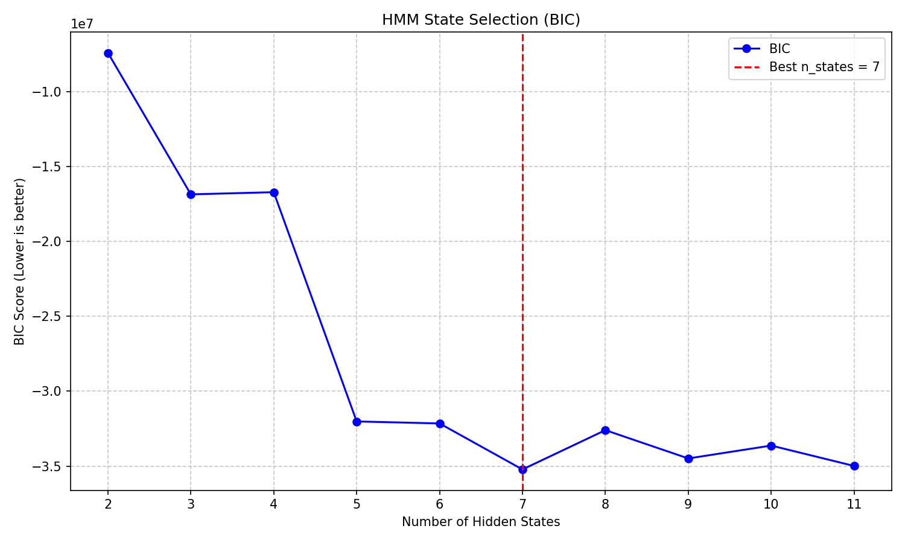
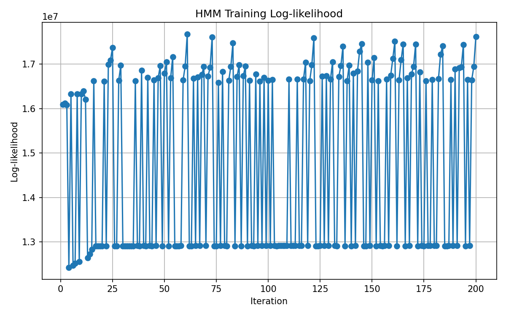
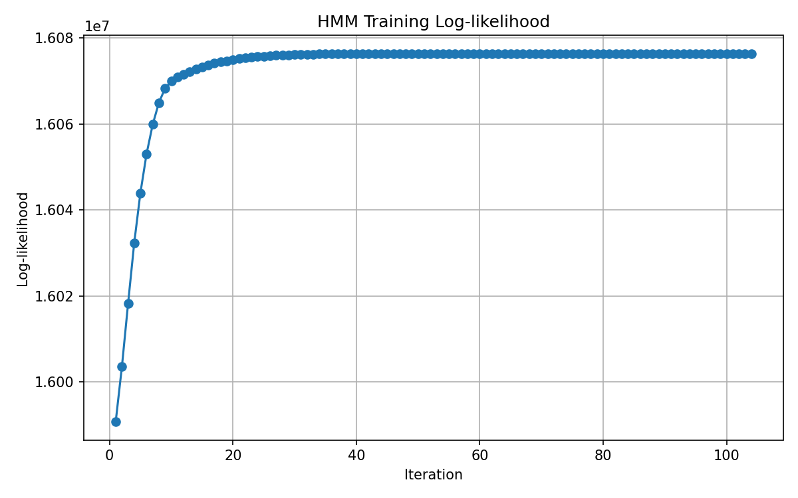
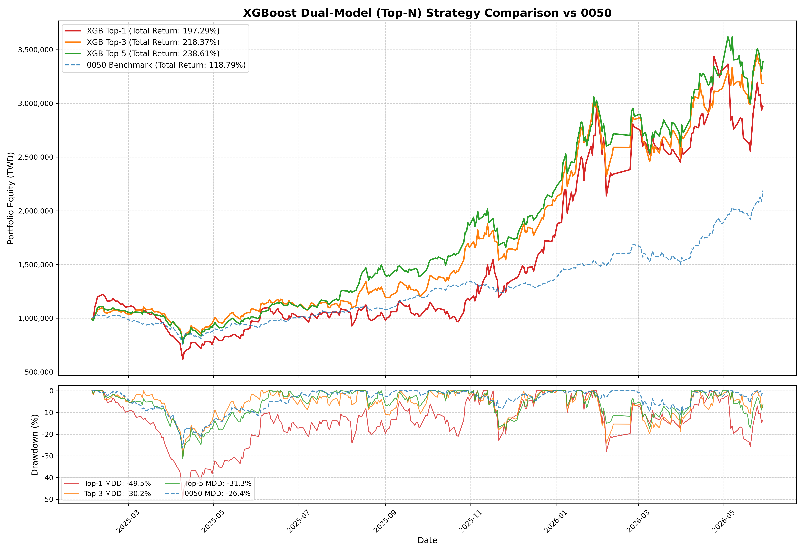
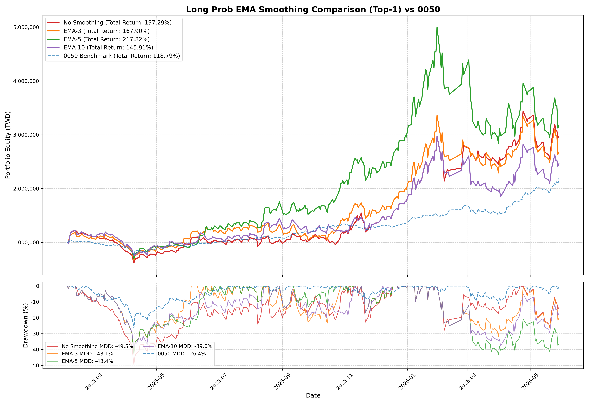
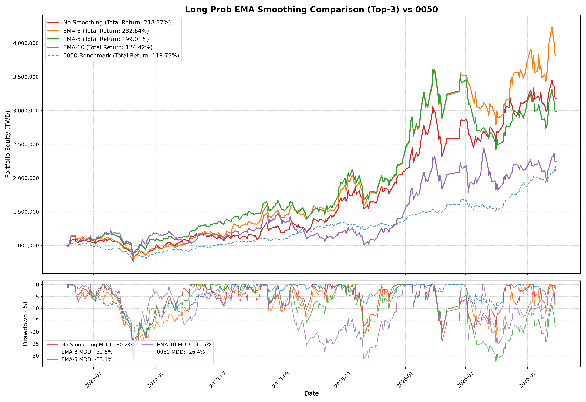
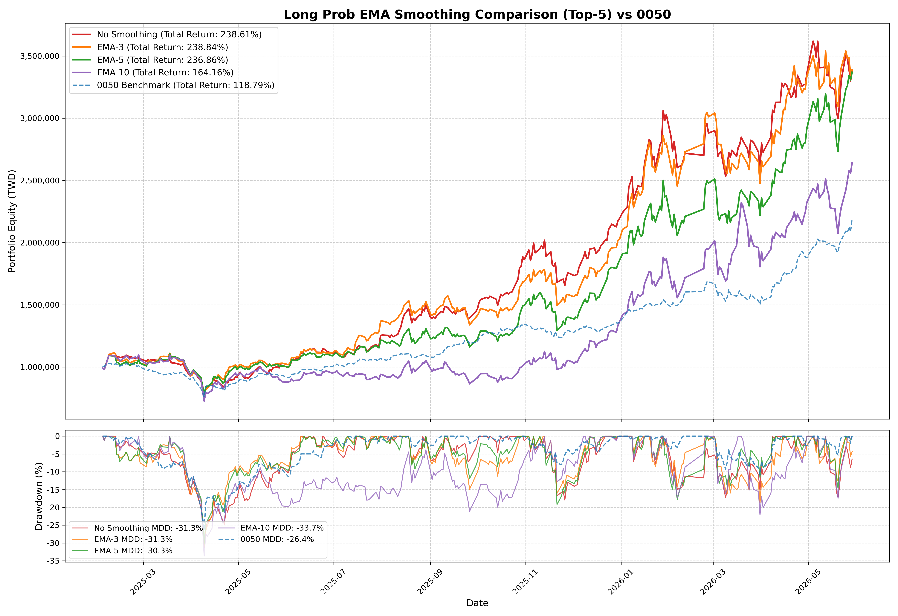

# Data Split

- training: 2021/06/30 ~ 2024/02/05
- validation: 2024/02/15 ~ 2025/01/22
- evaluation(backtest): 2025/02/03 ~ 2026/05/29

# HMM

- covariamce type: full
- random seed: 25



Thought 7 states have the lowest BIC score, the log-likelihood did not converge.  
  
Pick 6 states instead.  
 

# XGBoost

## 資料切分
```
[Long]
  Train      : 691,973 | Base rate: 16.13%
  Validation : 264,820 | Base rate: 17.47%
  Evaluation : 368,136 | Base rate: 21.41%

[short]
  Train      : 691,973 | Base rate: 10.59%
  Validation : 264,820 | Base rate: 12.28%
  Evaluation : 368,136 | Base rate: 11.84%
```

## 訓練結果

### Long model

【Top 7 最佳 F1-score 門檻紀錄】(已按門檻由小到大排序)

|信心門檻 | 觸發交易次數 | 實戰勝率 (Precision) | 捕捉率 (Recall) | f1_score|
|---|---|---|---|---|
|>= 0.60 | 51,906 次 | 27.06% | 30.36% | 0.2861|
|>= 0.61 | 46,148 次 | 27.63% | 27.56% | 0.2759|
|>= 0.62 | 40,779 次 | 28.15% | 24.81% | 0.2637|
|>= 0.63 | 35,842 次 | 28.73% | 22.26% | 0.2508|
|>= 0.64 | 31,233 次 | 29.29% | 19.77% | 0.2360|
|>= 0.65 | 26,654 次 | 29.92% | 17.24% | 0.2188|
|>= 0.66 | 22,271 次 | 30.62% | 14.74% | 0.1990|

【最終測試報告 - 套用門檻: 0.60】

|觸發交易次數 | 實戰勝率 (P) | 捕捉率 (R) | F1 Score|
|---|---|---|---|
|68,199 次 | 33.44% | 28.93% | 0.3102|

### Short model

【Top 7 最佳 F1-score 門檻紀錄】(已按門檻由小到大排序)

|信心門檻 | 觸發交易次數 | 實戰勝率 (Precision) | 捕捉率 (Recall) | f1_score|
|---|---|---|---|---|
|>= 0.60 | 60,560 次 | 20.40% | 37.99% | 0.2655|
|>= 0.61 | 54,795 次 | 20.86% | 35.14% | 0.2618|
|>= 0.62 | 49,455 次 | 21.28% | 32.35% | 0.2567|
|>= 0.63 | 44,251 次 | 21.71% | 29.54% | 0.2503|
|>= 0.64 | 39,493 次 | 22.16% | 26.90% | 0.2430|
|>= 0.65 | 34,942 次 | 22.67% | 24.35% | 0.2348|
|>= 0.66 | 30,707 次 | 23.16% | 21.86% | 0.2249|

【最終測試報告 - 套用門檻: 0.60】

|觸發交易次數 | 實戰勝率 (P) | 捕捉率 (R) | F1 Score|
|---|---|---|---|
|74,040 次 | 18.17% | 30.87% | 0.2287|

# 回測結果

## 實盤模擬回測結果 (初始 100 萬) - 多檔持股大對決                           

|指標             | Top-1       | Top-3       | Top-5       | 0050大盤|
|---|---|---|---|---|
|期末淨值         | 2,972,918   | 3,183,717   | 3,386,059   |   2,187,856|
|總報酬率         |    197.29% |    218.37% |    238.61% |    118.79%|
|最大回撤(MDD)   |    -49.55% |    -30.22% |    -31.34% |    -26.37%|
|總交易次數        |        30 次 |       124 次 |       191 次 |        N/A|
|實戰勝率         |     53.33% |     53.23% |     54.97% |        N/A|

## EMA 做多平滑策略對比結果 (Top-1, 初始 100 萬)                            

|指標             | No Smoothing   | EMA-3          | EMA-5          | EMA-10         | 0050大盤|    
|---|---|---|---|---|---|
|期末淨值         | 2,972,918      | 2,678,964      | 3,178,212      | 2,459,121      |   2,187,856|
|總報酬率         |       197.29% |       167.90% |       217.82% |       145.91% |    118.79%|
|最大回撤(MDD)   |       -49.55% |       -43.13% |       -43.40% |       -39.05% |    -26.37%|
|總交易次數        |          30 次 |          45 次 |          53 次 |          38 次 |        N/A|
|實戰勝率         |        53.33% |        51.11% |        58.49% |        68.42% |        N/A|

## EMA 做多平滑策略對比結果 (Top-3, 初始 100 萬)                            

|指標             | No Smoothing   | EMA-3          | EMA-5          | EMA-10         | 0050大盤|    
|---|---|---|---|---|---|
|期末淨值         | 3,183,717      | 3,826,354      | 2,990,149      | 2,244,226      |   2,187,856|
|總報酬率         |       218.37% |       282.64% |       199.01% |       124.42% |    118.79%|
|最大回撤(MDD)   |       -30.22% |       -32.51% |       -33.05% |       -31.46% |    -26.37%|
|總交易次數        |         124 次 |         116 次 |         107 次 |         152 次 |        N/A|
|實戰勝率         |        53.23% |        54.31% |        53.27% |        50.00% |        N/A|

## EMA 做多平滑策略對比結果 (Top-5, 初始 100 萬)                            

|指標             | No Smoothing   | EMA-3          | EMA-5          | EMA-10         | 0050大盤|    
|---|---|---|---|---|---|
|期末淨值         | 3,386,059      | 3,388,356      | 3,368,641      | 2,641,595      |   2,187,856|
|總報酬率         |       238.61% |       238.84% |       236.86% |       164.16% |    118.79%|
|最大回撤(MDD)   |       -31.34% |       -31.27% |       -30.32% |       -33.69% |    -26.37%|
|總交易次數        |         191 次 |         197 次 |         191 次 |         226 次 |        N/A|
|實戰勝率         |        54.97% |        53.81% |        52.88% |        53.98% |        N/A|

## 淨值曲線圖

### 多檔持股大對決 (Top-1 / Top-3 / Top-5 / 0050)


### EMA 做多平滑策略對比 (Top-1)


### EMA 做多平滑策略對比 (Top-3)


### EMA 做多平滑策略對比 (Top-5)
